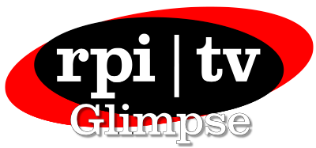

<!--suppress HtmlDeprecatedAttribute -->

# Glimpse &middot; 

Monorepo for the RPI TV internal infrastructure connected to the Glimpse ecosystem.

Glimpse currently encompasses the following services:

- Vue-based web UI
- NestJS-based GraphQL API
- Live broadcast graphics system
- Discord integration
- Developer CLI
- Livestream control and distribution service

For more information about the project and each service, check out the [project wiki](https://github.com/rpitv/glimpse/wiki/API) and their 
individual README files.

View the project in action at https://rpi.tv/.

## Licensing

This project is licensed under the MIT License - see the [LICENSE](LICENSE) file for details.
